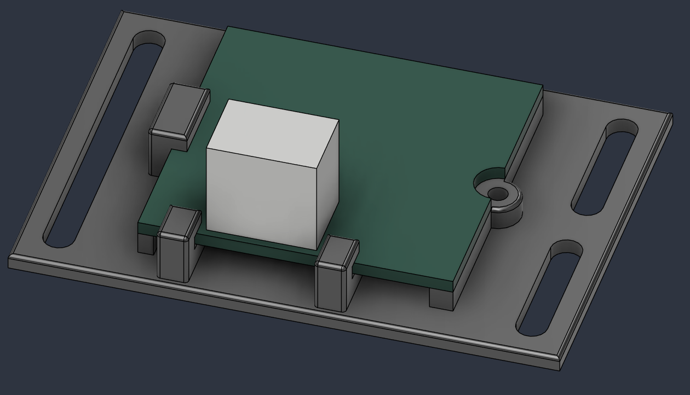
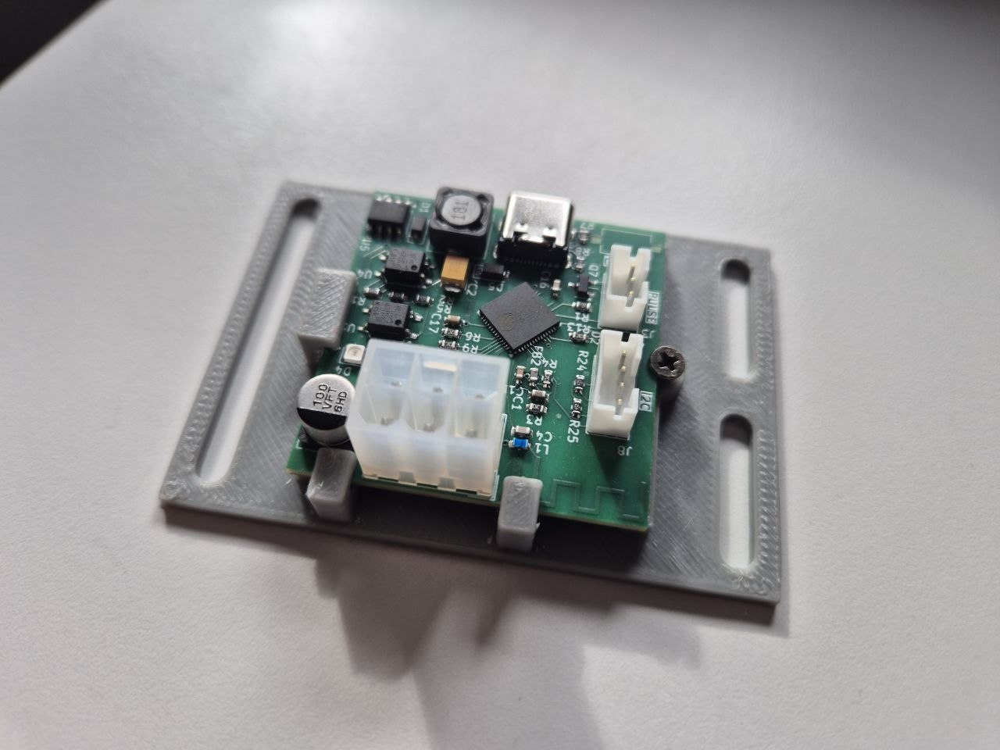

This is a more stable version of the 3D holder for the MDB PCB with SIM Modem.

Features:
Improved Stability: Features an added support structure directly at the MDB connector to provide better stability when plugging and unplugging cables.

Important Note / Warning:
Due to printing tolerances, you need to be careful and may have to manually adjust the print before inserting the PCB. 
Please take care not to damage the board or the Wi-Fi antenna trace located in this area.

3D-Preview

Real-Preview

